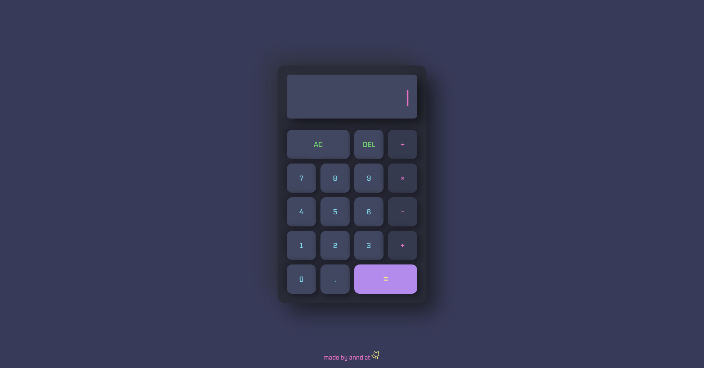

# Draculator

A calculator project from [**_The Odin Project_**](https://www.theodinproject.com/lessons/foundations-calculator) curriculum that was inspired by the _VSCode theme [**"Dracula"**](https://draculatheme.com/visual-studio-code)_.

### [Visit the project](https://anndcodes.github.io/calculator/)

## About the Project:
A calculator that runs basic math operations such as addition, subtraction, multiplication and division.
## Features
* AC funcion to clear display screen
* Backspace that deletes the last number
* Animate cursor that appears before clicking numbers and after clicking "AC"
* Operations can be done by using "equals sign" or using the "operators signs" if user wants to make an operation with multiple numbers and operators
* Block "equals sign" if no number or operator is chosen 
* User can make decimal operations and get floating point numbers 
* Keyboard support 
  * AC: Esc
  * DEL: Backspace
  * Equals: Enter
  * ×: *
  * ÷: / 
  * (+ and -, decimal point and numbers 0-9)

## Resources 
* [Font](https://www.fontshare.com/fonts/nippo)
* [Icon](https://phosphoricons.com/)
* [Favicon](https://www.streamlinehq.com/icons?tab=free&search=calculator)

--- 

Made with 💜 by [**Annd**](https://github.com/anndcodes)